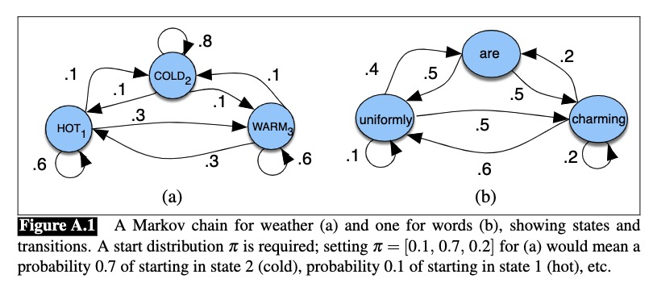
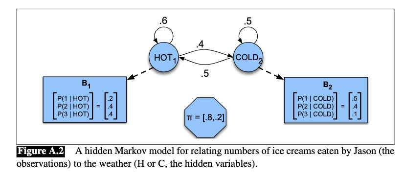
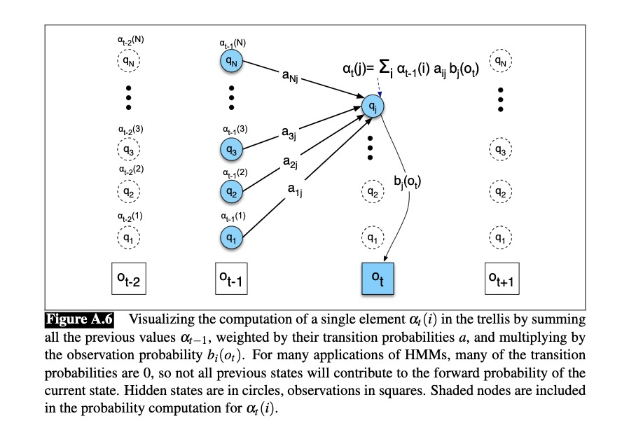
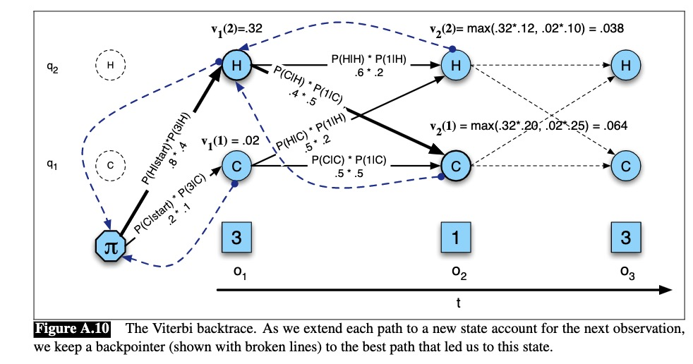

# Hidden Markov Models
## Markov Chains

Markove Chains is a directed graphical model. It tell us about the probability of sequences of random varibales , state. (Or the probaility of each node in the directed graphical model)

Exampe:



<center> Figure 1 - Directed Graphical Model  </center>

Markov Assumption:

$q_{1},...,q_{i-1}$ is a list of state varibales. i represents timestamp.


$$ P(q_{i} = a|q_{1},...,q_{i-1}) = P(q_{i} = a|q_{i-1}) $$

The future state variable is conditional independent of past state variable given current state variable. 

$$ q_{i} \perp q{i-2}, ... \mid q_{i-1} $$

This assumption hugely decrease the complixcity of programming about Markov Models.

In a Markov Models, each state variable $Q=q_{1},...,q_{N}$ has two properties: Initial probability $\pi = \pi_{1},...,\pi_{N}$ and transition probability $A = a_{1},..., a_{N}$. 

Initial probability means the probability of picking one certain node as the head or start node.

Transition probability means the probability of moving one node to the next linked node.


A Java Class exmaple of Markov Chain.

```
int N = Total_Num_Node
Class MarkovChains{
    float intial_probability;
    float[] trans_probability;
    MarkovChains[] node;

}

```

# Hidden Markov Model

In Hidden Markov Model, the states $Q$ can not be observed. But some events $O = o_{1},...,o_{T}$ which are caused by states can be get by observation. These obeserved event can be used to interfer the whole picture of the model.
The probability of the obervation events $O$ generated from states $Q$ is called observation likelihoods $B = b_{i}(o_{t})$.

But there is one more assumption of Hidden Markov Model besides Markov Assumption.

Output Independence:

$$
P(o_{i}\mid q_{1},...,q_{T}, o_{1},...,o_{T}) = P(o_{i} \mid q_{i})
$$


<center> Figure 1 - HMM  </center>

# Forward Algorithm


## Brute Force
According to Bayes Rule:

$$
P(O, Q) = P(O \mid Q) \times P(Q) = \prod P(o_{i} \mid q_{i}) \times \prod P(q_{i} \mid q_{i - 1})
$$

$$
P(O) = \sum_{Q} P(O, Q) = \sum_{Q} P(O|Q) P(Q)
$$

But the complexity of the traditional calucation above is exponential. For an HMM with N states and T  observation, there are $N^T$ possible hidden sequences.

## Dynamic Programming
Let define:

$\alpha_{t-1}(i)$: the previous forward path probability from the previous time step

$\alpha_{ij}$: the transition probability from previous state $q_{i}$ to current state $q_{j}$

$b_{j}(o_{t})$: the state observation likelihood of the observation symbol $o_{t}$ given the current state j


<center> Figure 3 - Forward Trellis  </center>

1. Initialization:

$$\alpha_{1}(j) =  \pi_{j}b_{j}(o_{1}), 1 \le j \le N$$

2. Recursion:

$$
\alpha_{t}(j) = \sum_{i = 1}^{N} \alpha_{t-1}(i)\alpha_{ij}b_{j}(o_{t}); 1\le j\le N, 1 \le t \le T
$$

3. Termination

$$
P(O \mid \lambda) = \sum_{i = 1}^{N} \alpha_{T}(i)
$$

$$\lambda = \{A, B\}$$


# Viterbi Algorithm


## Disadvantage of  Fordward Algorithm
Practically, the method in the prev section can not be used to detetrmine the most probably sequence of states $Q$ because there are exponetially larege number of state sequences. Even all the possiblity of each state in the model is known, finding a best path in the figure 3 seems to require a lot of computation. 

## Improvement

1. Use maximum over all possible previous state sequences($v_{t}(j)$) instead of sum of them($\alpha_{t}(j)$)(See figure 4)

$$v_{t}(j) = \max_{i=1}^{N}v_{t-1}\alpha_{ij}b_{j}(o_{t})$$

2. BackPointers
In Viterbi algorithm must produce the probability which the forward algorithm produces either , and also the most likely state sequence. So all the most likely state in each T time are recorded in `BackPointers`. After that, at the end of the T, it is more convenient to back trace the best path to the beginning. 


<center> Figure 4 - BackTrace Trellis  </center>

3. Algorithm

Observationsof len T

State-graph of len N

   1. Initialization:

       $$ v_{1}(j) = \pi_{j}b_{j}(o_{1}), 1\le j \le N$$

       $$
       back_{1}(j) = 0, 1\le j \le N
       $$
2. Recursion


   $$
   v_{t}(j) = \max_{i=1}^{N}v_{t-1}(i)\alpha_{ij}b_{j}(o_{t}); 1 \le j \le N, 1 \le t \le T
   $$

   $$
   back_{t}(j) = \argmax_{i=1}^{N}v_{t-1}(i)\alpha_{ij}b_{j}(o_{t}); 1 \le j \le N, 1 \le t \le T
   $$

3. Termination


   The best score at T $=\max_{i=1}^{N}v_{T}(i)$

   The start of back trace $\argmax_{i=1}^{N}v_{T}(i)$ 
   
   Use the start of back trace to keep tracking the states in $back$, then the most likely state sequence will be got.

# HMM Training 

There are only two variables, $\alpha$ and $b$ in the algorithms above. Let define 

`Learning`: Given an obeservation sequence $O$ and the set of possible states in the HMM, learn the HMM parameters $A$ and $B$

## Expectation - Maximization

### Backward Probability

The backward probability $\beta$ is the probability of seeing the obseravation from time t + 1 to the end, given that we are in state i at time t(given $\lambda$).

$\beta_{i}(i) = P(o_{t+1}, o_{t+2}..,o_{T} \mid q_{t} = i, \lambda)$

Algorithm of calculating $\beta$

1. Initialization

  $$ 
  \beta_{t}(i) =  1, 1 \le i \le N$$

2. Recursion

   $$
   \beta_{t}(i) = \sum_{j = 1}^{N} \alpha_{ij}b_{j}(o_{t+1})\beta_{t+1}(j), 1 \le i \le N, 1 \le t < T
   $$

3. Termination:

   $$ P(O \mid \lambda) = \sum_{j = 1}^{N} \pi_{j}b_{j}(o_{1})\beta_{1}(j)$$

Combining $\alpha$ and $\beta$ to represent $P(O \mid \lambda)$


## Expectation Step

Define the probability $\xi_{t}$ as the probability of being in state i at time t and state j at time t+1, given $O, \lambda$

$$\xi_{t}(i,j) = P(q_{t} = i, q_{t+1} = j \mid O, \lambda)$$

$\lambda$ is not known. So currently $\xi$ can not be calculted just by the information provided now. 

However, by applying bayes rule,

$$
\xi_{t}(i,j) = \frac{P(q_{t} = i, q_{t+1} = j , O \mid \lambda)}{P(O \mid \lambda)}
$$

where

$$
P(q_{t} = i, q_{t+1} = j , O \mid \lambda) = \alpha_t(i)a_{ij}b_j(o_{t+1})\beta_{t+1}(j)
$$

The $a$ and $b$ in the equation above is actually unkown since $\lambda$ is unkown. But they will be determined in the Maximization step. And then $\alpha, \beta$ will also be calculated.


Let define $\gamma_t(j)$ as the probability of being in state j at time t.

$$\gamma_t(j) = \frac{P(q_{t} = i = j , O \mid \lambda)}{P(O \mid \lambda)}$$

$$\gamma_t(j) = \frac{\alpha_t(j)\beta_t(j) )}{P(O \mid \lambda)}$$


## Maximization step

### Transition Probability Estimation
$$
\hat a_{ij} = \frac{\text{expected number of transitions from state i to state j }}{\text{expected number of transitions from state i}}
$$


``Recall``
 $\xi_{t}$ is the probability of being in state i at time t and state j at time t+1, given $O, \lambda$

If we knew this probability for each
particular time t, we could sum over all times t to estimate the total count for the transition i→j.

And if we sum over all transition out of state i, we can get the expected number of transitions from state i. 

$$
\hat a_{ij} = \frac{\sum_{t=1}^{T-1}\xi_t(i,j)}{\sum_{t=1}^{T-1}\sum_{k=1}^{N}\xi_t(i,k)}
$$

### State Observation likelihood Estimation

$$
\hat b_j(v_k) = \frac{\text{expected number of times in state j and observing symbol }v_k}{\text{expected number of times in state j}}
$$

``Recall``
Let define $\gamma_t(j)$ as the probability of being in state j at time t.

If we sum up $\gamma$ for all time steps t in which the obervation $O$ is $v_k$, we can get the $\text{expected number of times in state j and observing symbol }v_k$. For the $\text{expected number of times in state j}$, we can simply sum up $\gamma$ for all time steps t.

$$
\hat b_j(v_k) = \frac{\sum_{t = 1, s.t. O_t = v_k}^{T} \gamma_t(j)}{\sum_{t = 1}^T \gamma_t(j)}
$$

## Algorithm

Observations of len T, output vocabulary V, hidden state set Q


``Initialize A, B``

``Iterate until convergen``
 
 E-step

$\gamma_t(j) = \frac{\alpha_t(j)\beta_t(j) )}{P(O \mid \lambda)},\forall t,j$


$$
\xi_{t}(i,j) = \frac{\alpha_t(i)a_{ij}b_j(o_{t+1})\beta_{t+1}(j)}{P(O \mid \lambda)}, \forall t, i, j
$$

M-step

$\hat a_{ij} = \frac{\sum_{t=1}^{T-1}\xi_t(i,j)}{\sum_{t=1}^{T-1}\sum_{k=1}^{N}\xi_t(i,k)}$

$\hat b_j(v_k) = \frac{\sum_{t = 1, s.t. O_t = v_k}^{T} \gamma_t(j)}{\sum_{t = 1}^T \gamma_t(j)}$

``return A, B``


# Reference
This is my personal note of the book ``
Speech and Language Processing.  Daniel Jurafsky & James H. Martin``